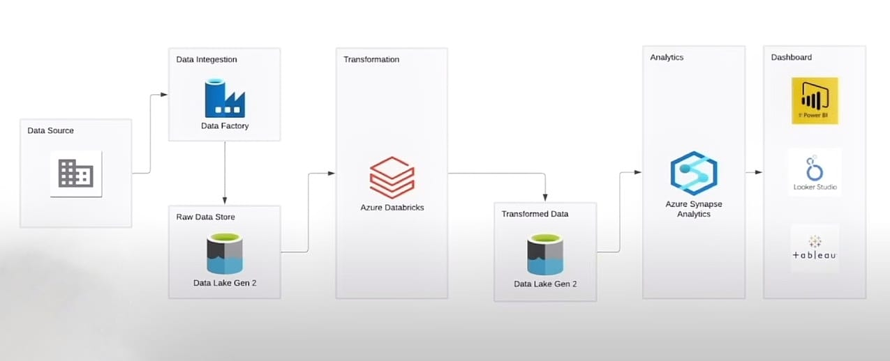
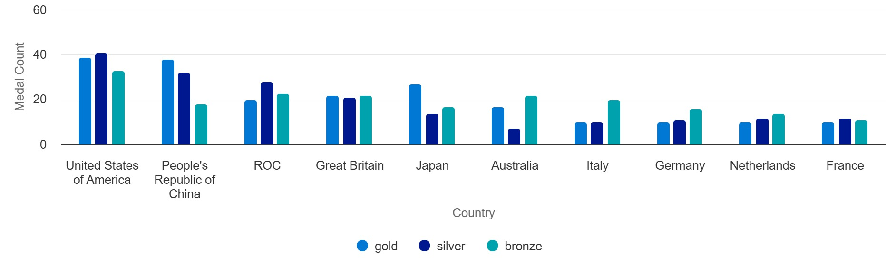
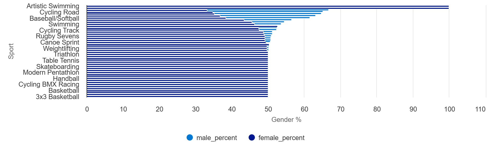
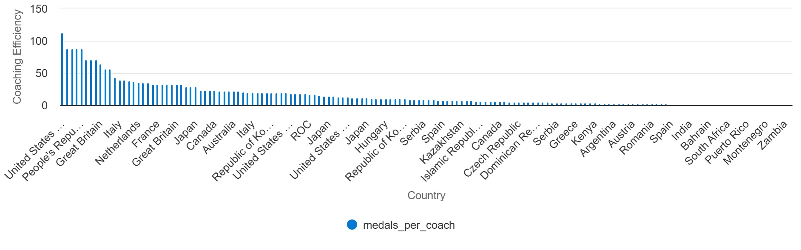
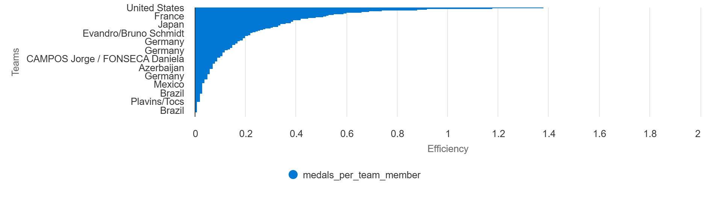

# 🏅 Azure Olympic Insights – End-to-End Data Engineering Project

A complete end-to-end data engineering solution built using Microsoft Azure tools to analyze the **Tokyo Olympics dataset**. This project covers everything from data ingestion to visual analytics, using a modern Azure stack.

---

##  Project Goals

-  Ingest, clean, and transform Olympic data
-  Generate actionable insights for federations, coaching staff, and analysts
-  Showcase gender balance, medal efficiency, and coaching impact
-  Build an enterprise-scale pipeline using real Azure services

---

##  Architecture

---
##  Technologies Used

| Tool | Purpose |
|------|---------|
| **Azure Data Factory** | Ingest raw CSV files from GitHub |
| **Azure Data Lake Gen2** | Store raw and transformed data |
| **Azure Databricks (PySpark)** | Transform and clean data |
| **Azure Synapse Analytics (SQL pool)** | Analyze transformed data using SQL |
| **Synapse Studio Charts** | Build dashboards and charts |
| **GitHub** | Source control and dataset storage |

---

## 🗃 Dataset Overview

Sourced from [Tokyo Olympics 2021 Dataset - Kaggle](https://www.kaggle.com/datasets), includes:

- `athletes.csv`: person_name, country, discipline
- `coaches.csv`: name, country, discipline, event
- `entriesgender.csv`: discipline, male, female, total
- `medals.csv`: team_country, gold, silver, bronze, total, rank_by_total
- `teams.csv`: team_name, discipline, country, event

---

##  Pipeline Stages

### 1. **Data Ingestion**
- Used Azure Data Factory to copy CSV files from GitHub to **Raw** zone in ADLS Gen2

### 2. **Data Transformation**
- Used Azure Databricks with PySpark
- Cleaned and enriched:
  - Renamed & typed columns
  - Calculated athlete/coach counts
  - Calculated gender gap & medal efficiency

### 3. **Data Storage (Transformed Zone)**
- Wrote all transformed DataFrames to `parquet` format in a **separate container** in ADLS

### 4. **Data Analysis**
- Created a Lake database in **Azure Synapse**
- Queried data using **serverless SQL pool**
- Ran analysis scripts for medal leaders, coaching impact, etc.

### 5. **Visualization**
- Used **Synapse Studio Chart View** for:
  - Top Countries by Medals
  - Gender Gap by Discipline
  - Coaching Efficiency
  - Team Medal Efficiency

---

##  Business Insights

### TopCountriesByMedals
> Identify countries dominating the medal tally

###  GenderEquity
> Showcases disciplines with high gender imbalance to support equity efforts

###  CoachingImpact
> Medals won per coach, per country/discipline

###  TeamEfficiency
> How efficient a team was based on medals per entry

---
##  Screenshots

###  1. Top Countries by Medals

###  2. Gender Gap by Discipline

###  3. Coaching Efficiency

###  4. Team Medal Efficiency

##  What I Learned

- Real-world usage of **Azure Data Factory**, **Databricks**, and **Synapse**
- How to build an end-to-end data pipeline from scratch
- Practical experience with **PySpark transformations** and **SQL analytics**
- Built lightweight **dashboards** inside Azure

---

